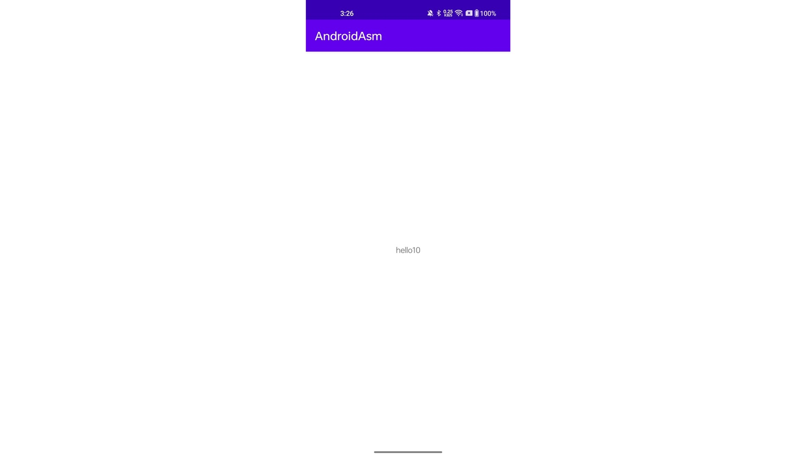

# 在AndroidStudio中使用Arm64汇编

首先创建一个Android Stuido的JNI工程。工程默认会生成一个C++文件，在Java侧调用native函数显示一个字符串。

Cpp这边生产的函数是静态绑定的，函数名字非常长，不太顺眼，先来改成动态绑定。先把冗长的函数改个名字。

```C++
JNIEXPORT jstring JNICALL StringFromJNI(JNIEnv *env, jclass clazz)
{
    std::string hello { "Hello World From JNI" };
    return env->NewStringUTF(hello.c_str());
}
```

接下来实现动态绑定。在Cpp文件中增加一个函数JniOnLoad，在这个函数中加载Java这边的native函数。

``` C++
jint JNI_OnLoad(JavaVM* vm, void* reserved)
{
    JNIEnv * env;
    vm->GetEnv((void**)&env,JNI_VERSION_1_6);

    JNINativeMethod methods[] ={
            { "StringFromJNI", "()Ljava/lang/String;",(void*)StringFromJNI },
    };

    env->RegisterNatives(env->FindClass("com/noemie/androidasm/MainActivity"),methods,1);
    return JNI_VERSION_1_6;
}
```

接下来我们要实现两个ARM64的汇编函数，一个函数返回一个数字，一个函数返回一个字符串。在StringFromJNI中组装两个汇编函数的返回值，再返回给Java，显示出来。

首先实现一个汇编函数直接返回一个数。在cpp目录下创建get_number.s。

``` assembly
.text
.global GetNumber
GetNumber:
    mov x0, #10
    ret
```

实现非常简单，声明了一个函数叫GetNumber，把常数10给寄存器x0，然后返回。在Arm汇编中，x0是放返回值的，类似x64中的rax。ret表示返回，在Arm32中是bx lr跳转指令，在Arm64是ret，这里需要注意。

接下来再实现一个汇编函数返回一个字符串，在cpp目录下创建get_hello_str.s。

``` assembly
.global GetHelloStr
.section .rodata
str:
    .asciz "hello"

.text
GetHelloStr:
    adrp x0, str
    add x0, x0, :lo12:str
    ret
```

首先在rodata段中声明一个字符串hello，然后text段中声明一个函数叫GetHelloStr，汇编adrp和下面的add是arm64中很常见的写法，是通过偏移拿到一个指定地址。具体原理就不详述了，本文主要是走通流程，这里最后x0里塞的就是上面这个字符串的指针。然后返回。

接下来回到C++这边。首先extern声明这两个汇编函数，然后调用。

``` C++
extern "C" int GetNumber(void);
extern "C" char* GetHelloStr(void);

JNIEXPORT jstring JNICALL StringFromJNI(JNIEnv *env, jclass clazz)
{
    std::string hello = std::string { GetHelloStr() } + std::to_string(GetNumber());
    return env->NewStringUTF(hello.c_str());
}
```

这样代码就写好了，接下里到Cmake里面加上两个汇编源文件。

``` cmake
# 声明启用汇编
enable_language(ASM)

# 两个汇编文件加入源文件
add_library(${CMAKE_PROJECT_NAME} SHARED
        get_number.s
        get_hello_str.s
        native_lib.cpp)
```

最后，到gradle中设置ndk。因为我们直接写了汇编，这个汇编是Armv8的64位的指令，在Armv7下是编译不过的，因此我们需要设置这个库只编译Armv8版本的。

``` kotlin
buildTypes {
    defaultConfig {
        ndk {
            abiFilters += "arm64-v8a"
        }
    }
}
```

这样build就可以了，在手机上应该可以顺利看到下图。




